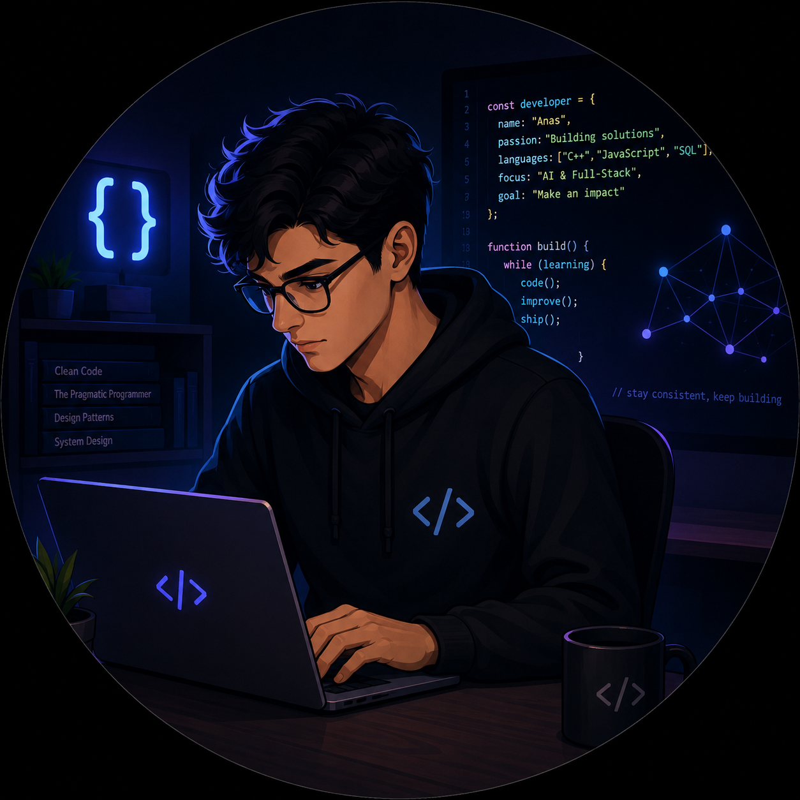

  

  # Anas

  ### Computer Science Student | Software Engineering | AI Application Development

  I build full-stack applications and AI-enabled software, with an interest in practical products, backend systems, APIs, and responsible AI integration.

## Technical Stack

### Languages

### Backend & Services

### Developer Tools

## Featured Projects

### [Gusto Restaurant Platform](https://github.com/nioshe/web-Resturant)

A responsive restaurant ordering and operations prototype built with HTML, CSS, JavaScript, and Supabase. It includes a customer-facing menu and cart, dine-in and takeout ordering, reservations, Supabase authentication, an admin dashboard for managing order and reservation statuses, and customer-to-admin messaging.

`JavaScript` `HTML` `CSS` `Supabase Auth` `PostgreSQL` `REST APIs`

### [Rahla.AI](https://github.com/nioshe/rahla-ai)

A Morocco travel-planning prototype with a modular Node.js and Express API. It demonstrates route-controller-service architecture, trip-planning and appointment workflows, and deterministic recommendation logic. Database persistence and external AI-provider integration are not currently implemented.

`JavaScript` `Node.js` `Express` `HTML` `CSS` `REST APIs`

### [C++ Word Scramble and CGPA Experiments](https://github.com/nioshe/cgpa_calculator.cpp)

A learning repository whose primary implementation is a C++17 command-line word-scramble application with difficulty levels, scoring, validation, file operations, leaderboard data, and runtime metrics. The repository also contains an early, incomplete CGPA interface experiment.

`C++17` `STL` `File I/O` `Regular Expressions` `JavaScript`

## Current Focus

- Full-stack application development
- Software engineering and computer science fundamentals
- Backend and API development
- Application security and automated testing
- Responsible AI integration in user-facing software

## Connect

